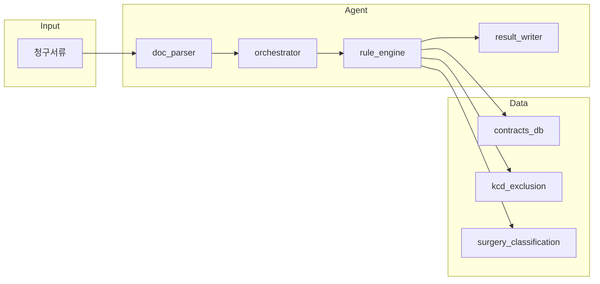
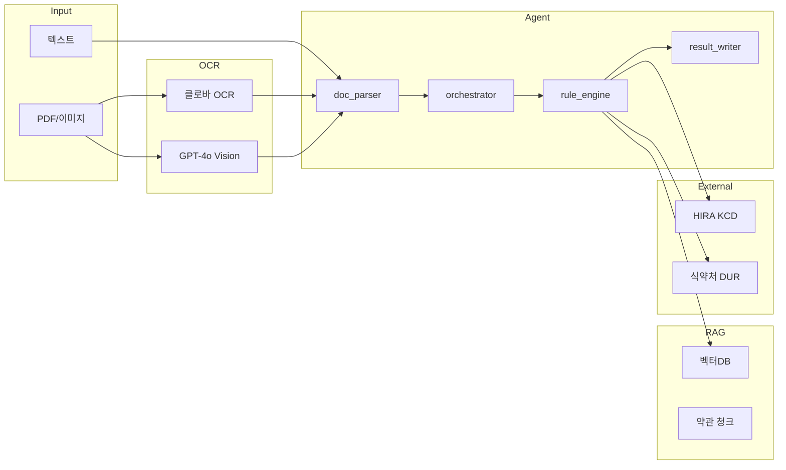

# 전체 시스템 아키텍처

> **목적**: Agent가 전체 흐름과 Phase1/2 구분을 한눈에 파악하기 위함.  
> **Agent 흐름**: 문서 파싱 → 컨텍스트 조립 → 룰 엔진 → 결과 문서 생성  
> **MCP/API 통합**: Phase 2에서 RAG, OCR, 공공 API 연동 추가.  
> **코드 연결점**: `src/agents/orchestrator.py`, `src/rules/rule_engine.py`, `config/settings.py`

---

## 1. Phase 1: 현재 구조 (현행)



### 1.1 처리 흐름

| Step | 모듈 | 역할 |
|------|------|------|
| 1 | `doc_parser.parse_claim_documents()` | 서류 디렉터리에서 텍스트 추출 → ParsedDocument 리스트 |
| 2 | `orchestrator.build_claim_context()` | ParsedDocument → ClaimContext (필드 병합) |
| 3 | `rule_engine.run_rules()` | COM → DOC → IND/SIL/SUR → FRD → FIN |
| 4 | `result_writer.write_results()` | ClaimDecision → 지급결의서, 고객안내문, decision.json |

### 1.2 데이터 소스

| 데이터 | 경로 | 용도 |
|--------|------|------|
| 계약 | contracts_db.json | 담보, 면책기간, 일당금액 |
| KCD 면책 | kcd_exclusion_map.json | COM-003 |
| 수술 분류 | surgery_classification.json | SUR-001 |
| 실손 세대 | silson_generation_map.json | SIL-001 |
| 청구 이력 | claims_history_db.json | (Phase 2 COM-004) |

---

## 2. Phase 2: RAG + OCR + API 통합 (예정)



### 2.1 Phase 2 추가 구성요소

| 구성요소 | 용도 |
|----------|------|
| **RAG** | 약관·룰북 벡터 검색 → 판정 근거 보강 |
| **OCR** | PDF/이미지 → 텍스트 추출 (클로바, GPT-4o Vision) |
| **HIRA API** | KCD 코드 검증, 수가코드 조회 |
| **식약처 DUR** | 비급여 주사료 허가 범위 확인 |
| **MCP** | Filesystem, SQLite, Fetch, Brave Search |

---

## 3. MCP/API 통합 구조

| MCP | 역할 | Phase |
|-----|------|-------|
| **Filesystem** | 프로젝트 디렉터리 읽기/쓰기 | P2 |
| **SQLite** | insurance.db (계약·청구 이력) | P2 |
| **Fetch** | HTTP API 호출 (HIRA, 식약처) | P2 |
| **Brave Search** | 약관·보험 기준 검색 (API 키 필요) | P2 |

---

## 4. 디렉터리 구조

```
지급보험금산정_agent/
├── config/
│   └── settings.py          # 전역 설정
├── data/
│   ├── reference/           # JSON 참조 데이터
│   ├── sample_docs/         # 테스트 서류
│   ├── policies/            # RAG 소스 (약관)
│   └── vectorstore/         # Chroma DB
├── docs/
│   ├── insurance_standards/  # 보험 기준 문서
│   ├── architecture/        # 아키텍처 명세
│   └── skills_mcp_api/      # MCP/API 가이드
├── src/
│   ├── agents/              # orchestrator, result_writer
│   ├── ocr/                 # doc_parser
│   ├── rules/               # rule_engine
│   └── utils/               # data_loader
└── outputs/                 # 청구별 결과
```
