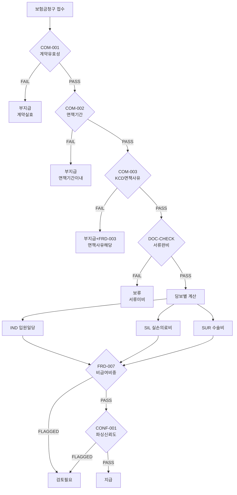

# 의사결정 논리구조

> **목적**: Agent가 룰 실행 순서와 분기(부지급/보류/지급)를 참조하기 위함.  
> **범위**: COM → DOC → IND/SIL/SUR → FRD 전체 플로우 및 법적 근거.  
> **코드 연결점**: `src/rules/rule_engine.py::run_rules()`

---

## 1. 전체 플로우차트

---

## 2. 각 분기의 법적 근거

| 룰 ID | 내용 | 법적 근거 |
|-------|------|----------|
| **COM-001** | 계약 유효성 | 보험업법 제4편 일반사항, 계약 상태·납입 상태 |
| **COM-002** | 면책기간 | 현대해상 약관 제3조 (면책기간), 질병 90일/재해 0일 |
| **COM-003** | KCD 면책사유 | 현대해상 약관 제2조 제1항 (알코올·마약·자해·미용) |
| **COM-004** | 중복·단기가입·반복 청구 | 금감원 보험사기예방 모범규준. FLAGGED 시 담당자 검토 |
| **DOC-CHECK** | 서류 완비 | 보험금 지급사유 조사 기준 (금감원), 진단서·입원확인서 등 |
| **IND-001** | 입원일당 | 약관 제4조 입원 정의, 별표 입원일당 지급기준 |
| **SIL-001** | 실손의료비 | 실손의료보험 표준약관 (금융위 고시), 세대별 계산식 |
| **SUR-001** | 수술비 | 약관 별표2 수술분류표, 1~5종 정액 |
| **FRD-007** | 비급여 비중 | 60% 초과 시 담당자 검토 (보험사기예방 모범규준) |
| **CONF-001** | 파싱 신뢰도 | PARSE_CONFIDENCE_THRESHOLD 미만 시 검토 |

---

## 3. 부지급/보류 사유

| 결과 | 사유 | 처리 |
|------|------|------|
| **부지급** | 계약 실효/해지 | COM-001 FAIL |
| **부지급** | 면책기간 이내 | COM-002 FAIL |
| **부지급** | KCD 면책사유 해당 | COM-003 FAIL |
| **보류** | 서류 미비 | DOC-CHECK FAIL |
| **검토필요** | FRD-007 비급여 비중 | FLAGGED |
| **검토필요** | 파싱 신뢰도 낮음 | CONF-001 FLAGGED |

---

## 4. 담보별 병렬 처리

| 담보 | 청구 시 | 룰 |
|------|---------|-----|
| IND | claimed_coverage_types에 "IND" | rule_ind() |
| SIL | claimed_coverage_types에 "SIL" | rule_sil() |
| SUR | claimed_coverage_types에 "SUR" | rule_sur() |

미청구 담보는 SKIP.
